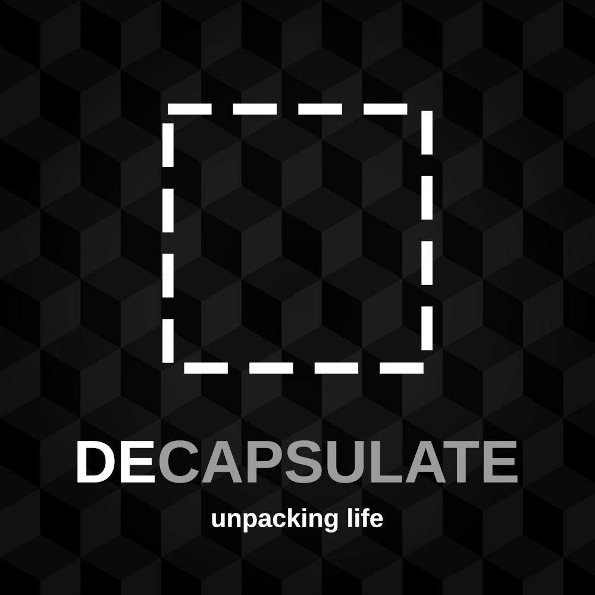

# [decapsulate.com](https://decapsulate.com) <a href="https://decapsulate.openstatus.dev/" title="decapsulate.com status"></a>



_A podcast hosted by [Tris](https://decapsulate.com/about/#tris) and [Robin](https://decapsulate.com/about/#robin), discussing tech, tools, and tips on how to survive inside a creative brain_

Feel free to poke around our [content](https://github.com/NamtaoProductions/decapsulate.com/tree/main/content) or [suggest](https://github.com/NamtaoProductions/decapsulate.com/issues/new/choose) your ideas.

This site is built using the elegant [Zola](https://getzola.org/), a [Rust](https://www.rust-lang.org/)-based static site manager.

## Running the site

After [installing Zola](https://github.com/NamtaoProductions/decapsulate.com/tree/main/content) on your platform, simply run:

``` shell
zola serve
```

And visit http://127.0.0.1:1111.

## License

<p xmlns:cc="http://creativecommons.org/ns#" xmlns:dct="http://purl.org/dc/terms/"><a property="dct:title" rel="cc:attributionURL" href="https://decapsulate.com">Decapsulate Podcast</a> by <a rel="cc:attributionURL dct:creator" property="cc:attributionName" href="https://decapsulate.com">Namtao Productions</a> is licensed under <a href="https://creativecommons.org/licenses/by-nc/4.0/?ref=chooser-v1" target="_blank" rel="license noopener noreferrer" style="display:inline-block;">CC BY-NC 4.0</a></p>
