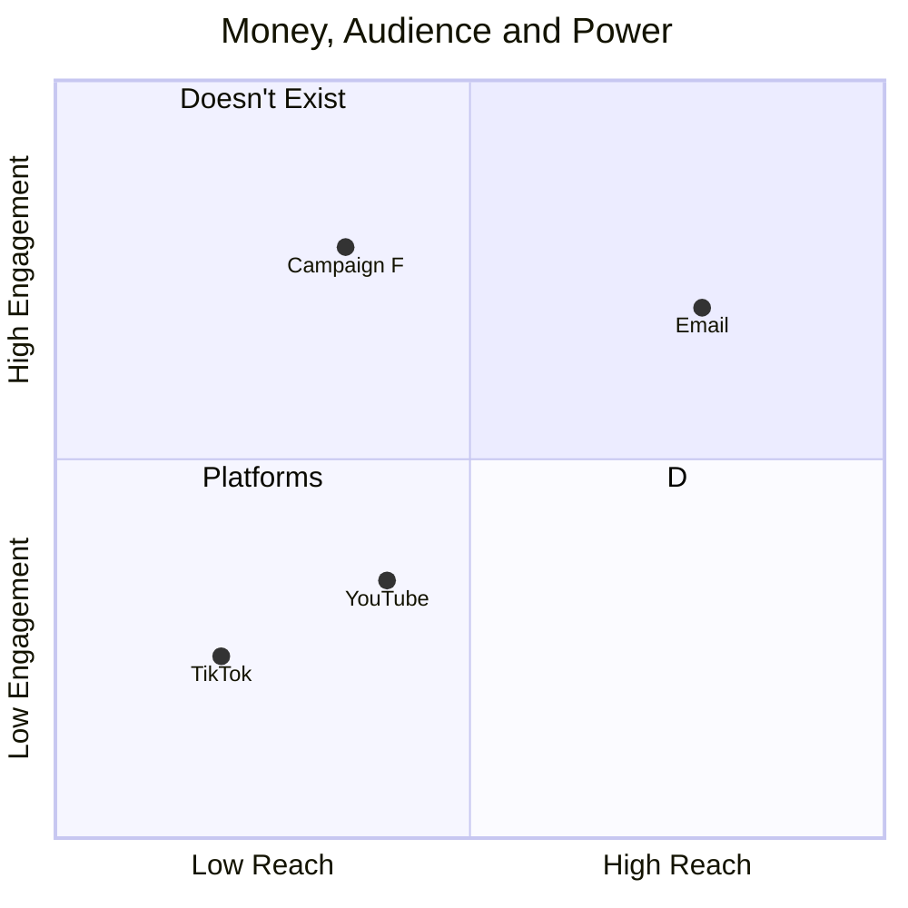

<audio controls src="/6.mp3"></audio>

> Tris & Robin talk about what it means to be an online creator in an age of Techno-Feudalism, and what to do about it.

# 📖 CHAPTERS

- 00:00 Tris's New Mentoring Tiers
- 17:01 De-Platforming and Diversifying Income
- 33:19 Deplatforming and Diversification
- 34:22 The Power Dynamics of Platforms
- 49:53 Techno-Feudalism Explained
- 58:50 The Future of Tech and Society

# The Matrix

## 🔗 LINKS

### Ours

- <https://robinwinslow.uk>
- <https://noboilerplate.org>
- <https://lostterminal.com>
- <https://modemprometheus.com>
- <https://phosphenecatalogue.com>

### External

- [ ] Techno-Feudalism Book

---

## 🧑 CREDITS

Decapsulate is a NAMTAO Production (namtao.com)

It is hosted by:

- Tristram Oaten (<https://mastodon.social/@0atman>)
- Robin Winslow (<https://union.place/@nottrobin>)

This work is BrainMade (<https://brainmade.org>)

# Transcript
# DC6-002

**Tris:** [00:00:00] We are about a month after I've launched the scholarship and diversity tears on my patron. 

**Robin:** I, yeah, we introduced the scholarship and diversity topic very briefly, I think in the last episode. It's quite interesting. I think it's, talk about the particulars of what you chose 

**Tris:** for the last couple of years.

What has allowed me to move from having a day job as a programmer to a internet creator, job, whatever it's called, writer is what I tell my mom. But I don't think that's descriptive enough. 

**Robin:** An internet 

**Tris:** writer. Do you write the internet? Yes, I write the internet. Well, I did before, and I suppose I still do now.

Um, but I'm using English this time rather than, uh, code. What allowed me to bridge that gap? Money was coming in from YouTube ads, which is wonderful, and lots of people joined my Patreon, which I'm incredibly grateful for. And the money was life changing, but not enough to pay all of my rent, so I had to keep the day job.

What did allow me to bridge that gap and get away from the day job was. Setting up a mentoring tier where a few people had asked me if I would do lessons if I do one-on-one tuition, that sort of thing. And I eventually said yes, because as a freelancer you should always say yes when people offer you to pay your money.

And it worked out really well. I got 10 or 15 people signed up and that was enough for me to cover my bills. I don't quite make as much as when I was working a day job, nine to five, uh, programming. But it's more than compensated for like how nice the work. It's, yeah. I'm my own, my own boss. You know, 

**Robin:** that was a question I had in my mind actually was whether at this point you are.

Making as much money as you were making or not, but yes, no, I completely agree. That like, quality of life 

**Tris:** Oh my God. Yeah. 

**Robin:** Very much improved. Yeah. It's the 

**Tris:** backward spending supply curve of labor whereby when you offer people more hours, they take them, but after your boss increases your salary to a certain point, you actually choose fewer hours.

'cause your basic needs are being met. And actually you'd rather buy your life back through doing less work, but more well paid work. 

**Robin:** Have we talked about this before? You, you wouldn't, you wouldn't necessarily. Sorry. If you'll allow me a, a tiny segue, because I found this quite interesting. Um, there's a podcast called The Happiness Lab, which I don't know whether I fully subscribe to, but sometimes when I wake up in the morning, I, I put it on because I think it helps sort of set my, my mood for the day.

Aw. 

Um, and the latest episode I was listening to is about this economist who I've forgotten the name of, but I can put in the notes who won a Nobel Prize, uh, a while ago, maybe in the eighties or nineties or something. 'cause of all the work he'd done critiquing the, the standard model of economics. Um, and one of the big ways is this thing that he called, I think he calls it the winner's paradox or something.

And the way he characterizes it is the, is this example where you go into a bar and you say, I've got this jar of coins. Um, whoever bids the most for this jar of coins can have them. And if there's, you know, any number, any significant number of people in that bar, the top bid for that jar will definitely be worth more than the actual number of coins at the jar.

Um, and so they will have, they will have lost out, um, 

**Tris:** right. 

**Robin:** And I feel a little bit like this is relevant in this thing about the job because you always want to be paid more and therefore you always want to work harder. And you, and sort of human nature doesn't really lead us to necessarily realizing that that's not really worth it.

From a personal perspective, if you see what I mean? 

**Tris:** Yes, uh, absolutely. 

**Robin:** Because we feel like a winner. 

**Tris:** Yes, of course. I feel a little, like, I must mention at this point that like my circumstances of where I live, the UK means that I can afford to do this a bit more. If I was in a country that didn't have universal healthcare or safe streets or like stuff like that, I might want to hedge way more and earn as much as possible to hedge against future problems, future calamities.

But I live in London. It's for all the small problems. Um, it is lovely, safe. Like I won't go bankrupt if I need a, an operation or ambulance to the hospital, something like 

**Robin:** that. Yeah, no, that's a, that's a good point. Yeah. You do need, obviously the support, the social support structure around matters a lot.

And um, I think probably a lot of our audience is American. 

**Tris:** I would say so. 

**Robin:** And, uh, the social support structure in America. Obviously, if your job is the only way that you get good healthcare, you might want to think about that. Yeah. That's a good point. 

**Tris:** I don't like thinking about it. So moving on. The last two years have been tremendously worthwhile from like a business point of view, and I've been able to buy back my time to make more creative works as well as supporting myself through mentoring.

I estimate that maybe in about five years time, maybe the, the other projects, YouTube and podcasts and so forth, would've increased their revenue to support my bills and so forth. [00:05:00] But this has been a nice shortcut to, to get there. That's certainly my goal. My goal is not to rely on mentoring the whole time, though I'm very pleased to be doing it, which leads me to over the last two years, I've wanted to open my mentoring up to people, like students who are less able to pay for it.

The mentoring is quite expensive. You know, one-to-one personal tuition is, is a very premium thing and I've always felt a bit weird about it, but you know, my bank has opinions about how much money I should earn and I have to follow what they would like me to do. That is now done. So last month I opened up these two new tiers, mentoring and diversity.

Initially you and I Robin talked off air about how about, I was initially just calling it scholarship, but also including diversity as well. By that I mean my audience tends to be white men because the tech industry is overwhelmingly leaning, um, in that direction. And I would like to do some affirmative action there too, to correct that in some small way.

I was inspired by Maker's Academy, which are a. Software retraining company here in London, and they do a 12 week conversion course. And like any degree, or any, or not even a degree, after 12 weeks, they can get you into like an entry level web development position. And they have a 10% discount for women and non-binary people because they, and they, their wording is very good in their blog posts.

They talk about being able to, like, they're in a position where they can like very s in a small way Correct. The, the bias in the industry in a small way. And I thought, well, if I can do that, I'll give it a go. It's, yeah, so small to be almost trivial, but it's not 

**Robin:** nothing. You may have mentioned it, but I, if you did, I'd forgotten that Maker's Academy was your inspiration, but it's very useful.

It's very interesting to know That's the, that's where it came from. Yeah. 

**Tris:** Yeah. Brilliant. My, yeah. Very nice. Talk to our anyone in, in the UK who's listening that if, if you want to learn programming. They're the way, they were the way forward before the pandemic. I was aware of them because I interviewed, I was a senior lead engineer at companies, and whenever we were interviewing for positions, it was really obvious when someone had come from Maker's Academy because they were excellent, not just technically because they, like, they'd retrained.

They were like, oh, here is a, a junior JavaScript developer. Well, that's fine. Here's a junior JavaScript developer with a law degree. Now you have my attention. Like they, it was amazing. 

**Robin:** I feel there's also a thing, a thing about that is that people, people also who retrain into something else. Yes. I feel like they have a level of intention about it that is, that is not there.

Yes. From someone who just comes in as a junior and you know, the age of like 20 or whatever. Because, because when you are 20 or so, you just kind of fall, you follow your feet and, and you fall into the path you fall into. But when you are older, it's the same with post grads. Yes. In, in courses because they, they come in like, like now if I were to go and study at university, I'd be so much more committed to it than I ever was when I was at uni in my twenties.

Oh my God. 

**Tris:** Yeah. Like, yeah, right. Exactly. I, I went to Plymouth University to do computer systems and networks for my degree and I went to Plymouth because they were the only ones that would have me. 'cause I failed all my exams and like, I didn't intend to do any of it. I was just like, Hey, what's available?

What can I do that isn't like. Stacking shelves at Tesco. I didn't think I would be very well suited for that. And then my next degree, I've got a master's in software engineering from Southampton. That was a little bit more intentional, uh, that that's where I stopped in formal education. And as you say, if I'd gone on, you know, to do like post grad stuff, PhDs or whatever, your intentionality must increase as your brain matures and you actually know what you want to do.

**Robin:** I meant specifically the job because I think even, you know, you do bachelor's, you do masters, you do PhD, that's still following a path. Yeah. I mean, particularly post grad students, they've deliberately left a path they were on at a, an age where they actually understand how the world works to then come and say, I now want to go and do this new thing.

And I think that the amount of intentionality needs to do that is significant. And probably the read the people who are trained through Maker's Academy, that's their journey, right? Absolutely. So they, so they care about the thing to a level that like, yes. I wouldn't have when I was like 24 working as a, as a junior developer.

**Tris:** Yeah. We got into software. I expect, I can speak for you, Robin, because it's fun. A, someone who is retraining is getting into software because it's important for the way they want to live their life and they think it's profitable and they've seen the job market, like they've got a way more holistic view than like computers fun.

Yes, please. Yeah. 

**Robin:** Yeah, exactly. Yeah. 

**Tris:** Oh, and by the way, the end, the end of the maker's story is that during the first lockdowns in 2020 and 2021, [00:10:00] my wife and I were working next to each other, desks next to each other in the same room, and she was accountant, she was as a chartered accountant and I was a web developer in a fairly.

Modern relaxed team doing agile scrum, that sort of thing, and Python. And after like six months, she was like, okay, you guys are having way too much fun. How do I retrain to become a software engineer? I wanna be a web developer. And she went to Makers Academy, my recommendation, and she had a great time there too.

So I've seen it from both sides through Ducey eyes. 

**Robin:** And I suspect she's a much highly developer than you are. Highly as, as we were talking about. 

**Tris:** Oh, absolutely. Yeah. Like, like she reads documentation. Yeah. Yeah. Much, much, much better. Right. So the reason I'm brought up Maker's Academy is because that made me think I should do a diversity initiative of some sort as well as a, uh, financial hardship scholarship sort of thing.

But originally I blurred them together, which made quite a lot of people including you. I think when we spoke about it a little uneasy because it blended social. Disadvantage with financial disadvantage. 

**Robin:** That's a very good description of my objections when we, when we first spoke about it. Yeah. 

**Tris:** Yeah. So the solution, and thank you Robin, for trusting me about that.

And thank and, and thank you to all the people who gave me feedback on that single scholarship tier. Splitting them up into two was the right thing to do. And I now have two cohorts of steeply discounted, one fifth, the price mentoring. And it's wonderful 'cause I can, I can help the people who I would never have reached otherwise.

Like rich white men are doing fine as a rule. Yes. So, 

**Robin:** so are they both, are they both the same discount then these two different tiers? 'cause I haven't actually looked. 

**Tris:** They are, they are in, in a perfect world there would be some more granularity, wouldn't there? But Patreon is quite a blunt instrument and so I've just put them at the same price just with some, some guidance.

And I found a lot of people ask me. Like, they email me before signing up. Almost no one signs up. They email and ask for permission. 

**Robin:** Oh, right, okay. You 

**Tris:** know, they say, oh, I'm a, I'm a woman in tech. Do I qualify? Or, I'm a student, but I'm not actually at university. I'm doing, you know, some other complex thing.

Do I qualify? And my answer to everyone is, yes, God. What? Of course. Come on. Yes, please. Like ev, everyone's so cautious, uh, about it. Like I've, in the back of my mind, my first reaction was, oh, what if people take advantage of it? And then immediately when I thought, thought that through. I realized it would never happen because it's not like you're buying a product and pretending to be a student to get a discount.

That happens all the time. What you're doing with the men, what people are doing with mentoring is signing up for a professional relationship, like an ongoing relationship where we will talk about their studies or talk about the challenges of being neurodiverse in our industry or, or whatever. Yeah. The idea of lying would mean that you shouldn't have the mentoring.

**Robin:** I do think that's a very, that's a very good point. Yeah. Although this kind of goes back to this more, I listening to this morning as well, because, um, people will generally do antisocial stuff much less than core sort of game theory. Economics would suggest that they would, people don't just try and game the system just because it's it, because, because if you added up on paper, it's profitable.

Right. In general, right? Like one, one of the clearest things was if people find a wallet and it has some money in it, you would think that the more money there is in the wallet, the less likely they'd be able they'd be to return the wallet full of money, but mm-hmm. It turns out the more money that's in the wallet, the more likely they are to return the wallet full of money.

**Tris:** Oh, that's lovely. Yeah. It's nice, isn't it? That makes sense. 

Yeah. God, it, it would be like, it's, it's empathy, right? Like if I lost 500 pounds in my wallet, that would ruin that. That could have huge repercussions. And so if you find 500 pounds at a wallet, it's like, oh, you would think, oh gosh, this person really needs help.

Exactly. 

Yeah. They can't lose this. Yeah. Or maybe there's other complex thoughts, but yeah. Oh, that's lovely. Yeah, it's very nice. These two new mentoring tiers going really well, 

**Robin:** and I'm delighted. Trs. I'm curious how many people have actually signed up for this since you launched it? 

**Tris:** Well, each tier. The diversity mentoring and scholarship mentoring has, uh, is capped at 10 people, so 20 in total, and I think 17 have signed up nine and eight across each.

So it's very close to May. Nearly 

fully booked. 

Yeah. Incredible. Oh, so clearly it's very popular. 

It, it is. And I, I couldn't be, couldn't be happier. So one of the reasons, apart from it being a nice thing to do and maybe the right thing to [00:15:00] do and so forth with the new tears, is that it also, uh, reduces my exposure to, to a single person unsubscribing, causing me financial hardship.

**Robin:** You mean mentoring in general? Does 

**Tris:** like if, I mean the new, the new, the new tiers. 'cause they're much less. They're, they're, they're $50 a month, which is much less than the normal mentoring tier, but there are way more of them. So it sort of spreads the risk. Um, it's, I, oh, I see. There's probably a name, probably a name for this in Oh, right.

In investing, you know, like it diversifying my investments, I suppose. But it takes up more of your time. Is that like Yes, certainly, certainly mean it's a 

**Robin:** significant discount. Presumably the previous tiers, the previous pricing structure, um, was, was such because you, you only have so many hours the rest of your hours you're trying to put into editing podcast.

So, so does that mean you are, are you suggesting that inherently you're therefore shifting that time from editing time and therefore time that's supporting YouTube or podcasts 

**Tris:** into mentoring time? Lower rate. 

Yes. I, I, I suppose so. Yeah. It's, um, 

it's a, like I've become more of a teacher with this, with this decision.

Mm-hmm. That's true. That's a good point. 

And diversifying is the reason diversifying my income is the reason I waited until Patreon was paying most, most of my bills before I quit my day job. I didn't do what many people do, which is rely on adverts or paid promotions through YouTube because that is risky.

Yep. 

And I think that's what we should talk about that for a bit. Yes. 

**Robin:** Yeah, 

**Tris:** absolutely. In the, in the table contents, we're calling this the cautious creator, and I think that describes me. I don't think of myself as a very cautious person, but I'm married to someone who has, uh, is a qualified accountant. So I am, uh, I have excellent advice.

**Robin:** Yeah, I have been given excellent advice. You mean we have actually discussed this quite a lot off air and that's why we chose this as a topic for this episode, and in it you have a way of thinking about de platforming, which is a term I really like the sound of, which I think is quite an interesting model for how you effectively protect yourself from being too much at the mercy of the whims of very large monopolies who have no real interest in looking after your livelihood.

**Tris:** I talked about diversifying before, but like it's got a specific name, as you say, to platforming in, in the creator community. I am sure that you, as well as Alisons will have seen a creator of some sort, YouTuber, someone on TikTok. Anyone in the public eye say something like, link in my bio, subscribe to my substack, get on my mailing list, come to this site and sign up for memberships.

Like a whole litany of different options. And the reason that that is so pervasive is because the platform, it shows that the platform, they are on YouTube or TikTok, what have you, our inherently risky for them and they know it and they would really like as many of their audience as possible to come over to this second place.

The, the place for me is Patreon, but it can also be a mailing list of Substack and like whatever, come over to that place. Get more personal content, more reliable content, and critically, critically for them as the creator gives them a more direct access and direct control of their audience because the platforms deliberately do not give you this control.

**Robin:** Yes, they also have an interest in making you put your link to de platform somebody like making the task of putting that in front of one of your listeners as hard as possible, which is why you often have, is it Discord or something? One of these platforms. It's particularly scary when you click on a link and it's like, this link's gonna take you off this platform.

Are you sure you wanna do that? Like, 

**Tris:** yes, yes. That's Discord. I think Rick Astley has a lot to take the blame for there. 

**Robin:** That's very generous of you. [00:20:00] 

**Tris:** I think Twitter does it worse. You know, they actually censor links to competing platforms like you can't paste a MAs on. Absolutely. Yeah. No. On Twitter, 

**Robin:** any, any of these tech tactics, you can see it being brazenly done with a complete mask off over on X.

Yes. 

**Tris:** Listeners of a certain delicate age will remember when you could just paste links and have them floating over YouTube videos at any point in the video and any, like, just a little post-it, a little link whenever you want a little caption and people made, like games. Choose your own adventures skill high, like, uh, ranking lists, like all kinds of stuff or like whatever.

Uh, but when YouTube switched from flash to HTML five video. They did not bring that fi functionality over instead giving us the pinned video at the top right and the end screen. Those are much, much, much more limited. Uh, the pinned stuff is really miserable for me because as an educator I talk about more than six things.

And in a video length of my, of my, like about 10 minutes, you can link to six things and they have to be kind of evenly spaced and you can only link to a thing once. Like it, it's, it's miserable and it's, uh, extremely suspicious as you say. It's obvious what they are doing. So people do this, uh, de platforming to gain a bit of control back, and it's an essential part of being a creator.

You can't start with a, an mailing list. You know, like my, my dad could, could start mailing list and then tell three friends and he would have three people on the mailing list. I, I, anyone could upload a YouTube video and it could go viral. Anyone could make their first TikTok video and it could go viral.

That's the promise of the platforms. 

**Robin:** Good example for that, I suppose could be my, my website, because I've had this blog for a long time. I've never done any advertising on it whatsoever. I've never paid for any promotion on it. Um, I have at various times tried to, you know, share articles that I've written on various platforms like Hacker News, Twitter, whatever, but only a little bit.

Um, and then about a year ago, or maybe a year and a half ago, I decided to add the ability to subscribe to a MailChimp, um, mailing list to the blog. Um, and the growth in that. Like it took a long time for that thing to get like 20 subscribers. And then now it's got, uh, hundreds, certainly hundreds, maybe like 800 

**Tris:** or something.

**Robin:** I'm not sure. But I don't know if they're real. They could all just be fake. But, but I haven't really been publishing any content at all. It's, it's a very interesting, um, dynamic. You've 

**Tris:** been busy this de platforming, moving from platforms that have an algorithm that can generate you a viral hit, moving to people off that, onto a different platform, like an mailing list or patron or something like that where you can target them directly or maybe even charge them money.

I see that as audience making platforms on one side and then a continuum down to the other side, which is money making platforms. 

**Robin:** Yeah. And what you mean by that is that, um, an audience making platform is one where the main value that they deliver is kind of in audience. It's kind of in that you can grow your audience and therefore you are not going to be paid a huge amount because.

The value proposition is largely taken up by this audience, um, growth potential. Yes. And then as you move into platforms where you get paid better, the audience growth potential drops because the value proposition more or less stays the same. And, and so if one increases the other has to drop. That's what you basically mean.

**Tris:** Two examples, perhaps we'll make it clear. Um, on one side you've got TikTok before they paid any ads, so like early days of TikTok, when there was no creator fund, uh, no, no products, no TikTok shop, none of this stuff. Um, and all it was was, oh, cool. Look at this haha funny platform. I'm like, you can go viral that you don't get, you don't get any direct money from that, but you get an audience and an audience can be converted to money.

So it was valuable from the start. The other side of that is a mailing list where people have to sign up and they get emails from you on. The topics that you write about it is extremely personal to sign up to a mailing list because you get access to, or you give access to your most personal, uh, inbox.

You are, you, you are meeting the, the customer right where they are, which is checking their mail. They're in a [00:25:00] mode to read through things and you can ask them for money. 

**Robin:** Yes. Right. So the point is that it's that the algorithm effectively between you and your users, this is almost a spectrum of algorithm.

It's like there's an algorithm between you and your, you and your, and your audience. And in YouTube you don't get to directly say only the people who I'm gonna talk directly to the people who subscribe to me. You have all these subscribers in theory, but YouTube actually takes all that away from you.

Because they don't really show people, only the people they subscribe to at all. They show them what they wanna show them. 

**Tris:** Yes. 

**Robin:** Whereas in, in the case of email, you get a direct line to the people you know have subscribed to you. So that's the spectrum that you mean. 

**Tris:** Yes. Yeah. Maybe it's like a direct link or relevancy perhaps.

You know, like having a lot of audience is all very well, a lot of views is all very well. 

**Robin:** Yeah. Well that's, to me, that's the difference. You know, in theory, if YouTube was not Liars, right, as in the way they've designed their platform, then that would simply be the difference between subscribers and views.

Because subscribers are people who actually have chosen to subscribe to your channel and will now see your videos. Because if YouTube was a, I would say the implication be behind someone subscribing to a YouTube channel is something like that. They will necessarily get a notification when you publish a new video, for example.

If 

that's not really true, what do you mean by subscriber? And I would say YouTube has really blurred the line of what exactly they mean by subscriber. Um, very, yes. This time next 

**Tris:** year, no subscribers, right? 

**Robin:** Yeah. But, but, um, but if, if they were actually genuine about it, then a subscriber would be just as good as a mailing list subscriber, because you 

**Tris:** possibly it would certainly be better.

**Robin:** Well, well, but the thing you're talking about is, is literally just that, you know, you can deliver that message directly to that person, right? 

**Tris:** Yeah. So I, I think the medium matters too. Like having email is quite a personal thing. You are reading it, it goes directly to the person. Even further down from email might be, uh, I dunno, A WhatsApp mailing list sounds awful.

Sign up for SMS notifications sounds awful, but like that would be even more personal, wouldn't it? That would, that would actually notify you. Um, maybe telegram groups do this. 

**Robin:** Yeah, no, that's true. So notifications, the power of the notification you get to send to someone matters a lot. And to me, email is not that nowhere near, like, I rarely check my email.

If I get something from a mailing list I've subscribed to, I'm pretty unlikely to actually read it. Like the, the only emails I care about are ones that are something new on YouTube, isn't it? Like, don't they say like, hit the bell? Isn't that like a thing that means I now want notifications every time this person publishes a new YouTube video.

Yes. Awful. I feel a bit like meaningless. Those, is it meaningless. 

**Tris:** Yes. And imagine if you subscribe, imagine if you hit notifications for every single channel. You'll subscribe to a hundred notifications every day, all the time. You'd switch 'em off immediately, like it's, it's self-limiting. 

**Robin:** You would so, so you, so you wouldn't do that?

No, but no, but what I mean is, to me, that's the real subscribing, because what does subscribing mean? If it's not, I want to get a notification. What I'm saying is, I think if I actually did that on a video, like let's say someone news, I actually want to know when they publish a new video. So I've installed the YouTube, the YouTube app, and now I say, give me notifications.

Every time someone news publish a video, and now it gives me notifications. That's actually something I'm much more likely to pay attention to than an email I get from a, from, from a mail mailing list subscription. Fair 

enough. 

**Tris:** Not everyone thinks like that. Some people prefer notifications. Some people prefer emails.

Like you, you've gotta spread out your, uh, you've gotta platform onto multiple, multiple things. You've gotta give people the option. Where are you? Where do you wanna get this? Yeah. Where do you want to get updates By email or mastodon by notification. But I 

**Robin:** suppose, I think that that means that the notifications point particularly is a little more complicated for me because I don't think a mailing list, I don't think a more, what I would call a more empowered, uh, as in you having more control over the relationship between you and the user, the listener, the, the audience.

Yeah. At least in the form of an email mailing list necessarily gives you more ability. Well, I mean, it does, I guess it does because YouTuber designing how encouraged you are to subscribe to any given video. Um, but, but, but the trouble with that, the thing is that, is that you fundamentally got the phone operating system sitting between, um, your, your connection to the user.

Like it controls all notifications. So maybe part [00:30:00] of the reason why I feel like if I subscribed, if I asked for notifications on a particular YouTube video, I'd actually be more likely to pay attention down that to a mailing list. Might be something to do with the way that Google have designed Android and Google have designed Gmail, to be honest.

**Tris:** Yes, perhaps. Uh, and also everyone manages their email differently. Some people can somehow manage an inbox zero, you know, pristine, perfect, uh, situation. I'm very fortunate. I, 

**Robin:** I don't know. I feel like no, I, I, I reject that a little bit or I wanna push back on it. All right. I think that, um, my experience of email just never being a reliable way to get a useful notification is very common.

At least, I'm not gonna say universal, but very, very common. And, um. As I say, I think it actually is quite an important point that the, the Android or Apple have a lot of control over the stickiness of any given notification that you might get. And the, and the app 

**Tris:** notifications tend to be much more, uh, they have much more power.

I am astonished to hear you say this 

really, 

because you are admitting that you are letting Google control your notifications, uh, when you could invest some time into figuring out, getting email working better, and then you would be free of their influence in this regard. Okay. 

**Robin:** Why does that surprise 

**Tris:** you?

Like you understand where the control points are? 

**Robin:** Yeah. 

**Tris:** In the digital attention economy, and I'm okay, 

**Robin:** but this is like, this is like the point we were talking about last time. Like we're all, we're all trapped in the system. 

**Tris:** Uh, maybe. I don't have notifications on my phone. 

**Robin:** Okay. Just turn 'em off. But like, you could, but then you have to make sure that you've designed a whole load of other places, ways to get the things you actually need to know about Indeed.

Like you can do that. But you are definitely, I mean, I I am not like you speaking as if you, as if you are the 50th percentile when you're about the 99th percentile in that regard. 

**Tris:** No, no. I, I'm speaking directly to you, Robin. I I understand that most people use their phones in the way, the Google market.

Okay. 

**Robin:** Right. But what I'm saying is, what I'm saying is, what I'm saying is I'm not, I'm, I'm not you. There are places in which I am probably a massive outlier. 

**Tris:** Mm. 

**Robin:** But. In most ways, I'm gonna be closer to the average as you are. Right. There's gonna be most ways in which, in which I'm closer to average, and you are closer to average.

Yeah. Trying to do what you are describing is a huge amount of effort, and you'd have to like really, really focus on designing, taking control of that particular part of your life. Me having the values I have has nothing to do with whether I've successfully managed to claw back any bit of power from the system, is what I, what I'm suggesting.

Fair enough. I mean, I, as I think is true with you, I think there's, you know, there be thousands of ways in which you don't, um, you don't live your values, right? Because you just haven't focused on making that Right. I'm 

**Tris:** a YouTuber who doesn't like YouTube. Like we, we all live in paradoxes for sure. Right?

**Robin:** Yeah, yeah, yeah. Exactly. Exactly. Um, back to the, uh, de platforming discussion. Yes. What we prepared or what you prepared as a, as a, I, sorry, I can't say we, I didn't do any of this. Um, you prepared this graph where you put, um, some. Platforms on this, uh, graph where one axis is like, are you getting audience or money, like it's audience to money, as in is the value that they give you paid in audience or is it paid in money?

And then the other axis was power, which, which I'm responsible for putting there, I think. And the reason is that I think this is a different, I think this is a different dimension. I think this is a very interesting, uh, discussion we had that led us to hear 

**Tris:** Yes, the, the listener is going to hear the final thesis based on like three hours of brainstorming.

By, by you and I. You, and by the way, you started by saying we, oh no, actually you No, no. We made this quadrant. I made left. Right. You made up down. Go on. Please. Credit where? Credit to do go on our, that's very kind. 

**Robin:** Yes. No. So to me, what's inherent in de platforming is the idea that you are trying to take your livelihood and wrench it from.

Platforms into being under your own control now. 

**Tris:** Yeah, 

**Robin:** this is definitely something of a spectrum because if you wrench your audience off YouTube and you, you put them somewhere else, you are probably still reliant on platforms to some extent. 

**Tris:** But yes, 

**Robin:** as in, uh, you gave me the example of you put a link that's like, subscribe to my substack in the description of the YouTube [00:35:00] video direct people there when they're listening to your, to your YouTube video.

The better thing about Substack Substack is another platform. Substack still has control through being another platform that you are accessing your audience through. But the better thing about Substack is that hopefully at the time of recording, I don't know this 'cause I don't really know Substack, but you say it's true.

Um, you. Actually get the email addresses of the people who subscribe to your substack at time of recording. Time of recording. Um, and that's, and that's quite an important point because the central thing that I'm thinking about is, is how much control have you actually got over the dynamics of where you make your money?

So for, so, you know, YouTube could be paying you consistently 3000 pounds a month, um, every month for five months. And there is absolutely nothing to guarantee you that they're not gonna change some facet of the algorithm without an update, without asking your permission. And next month you're gonna earn 500 pounds because they fundamentally control the algorithm that decides how much money you are paid and the algorithm that decides how much of, how much of the audience that YouTube control see your videos.

And to me, that progression in power control over. The way in which you can connect with the audience is the really centrally important thing. Um, and there is something of a, uh, a relationship between that and the amount of money you're given we're sort of suggesting, but um, yeah, but it, but it does feel like a different axis.

**Tris:** Yeah, there's definitely a, there is. I, I think there is a clear, intuitive, and, uh, shows up on this on our quadrant graph that the listener will be able to look at. Um, we'll put a link in the show notes. Um, the, the, there is definitely a relationship between like platforms where you don't have much power tend to be the ones that offer you an algorithm that can put your content in front of thousands of people.

And platforms where you have total power aren't obliged to give you anything so they don't. But you can have more direct access to those users and can then advertise and ask for money and products and services and that sort of thing. 

**Robin:** Yeah, I mean, there is the point that like, you know, at least in the current world, like in an ideal world, the amount of power that I would like, like we would like for, for people to be doing social media through a fully decentralized social media service based on open web standards, and therefore there was no central authority that had any power over the way that you are distributed to your social media audience.

Um, and you are taking payments through some open source payment software that you run on your own server, on your own website and you are like, you know, this would be the ideal, fully empowering infrastructure for you to reach an audience. That's kind of a fantasy in today's world. So in the best version of this, you are still gonna be sitting on top of a bunch of platforms.

As in your mailing list will be managed by MailChimp. Um, but, but I guess a version of that de platforming to me is therefore also the diversification that you start off talking at the beginning, talking about at the beginning. Yeah. If you are a YouTube creator, the entirety of your connection with your audience is through YouTube, and therefore it is de platforming simply to spread your audience across a few platforms.

It's further de platforming to use a stack of different services in the way that you reach your audience. 

**Tris:** Yes. It's, it's a very good idea to both increase, it's both de platform to platforms. You have more power and multiple of those, like, don't just check out my Substack also here's my Patreon, that sort of thing.

Absolutely. Yeah. In many ways it's, it's, it's, it seems like the old problem with musicians and labels, like the Beatles can be as good as anything but the labels. Bridge the gap to America? Yeah. Like, um, is it Apple? Their label, I, I forget what the name, the, the name of that label. Um, but like, your, your label has a huge, has resources to get your posters up, get your CDs in record stores, get your tracks being played on DJ, on, on, at the radio station by DJs.

Like they, their offer to you is virality, sort of, um, sure. Yeah. Which, if, if you were doing it yourself, you would not, you would not be able to, you'd only be able to have linear word of mouth feels. Yeah. Which is why it was a really kind of like, that, 

**Robin:** it was a really big thing about, um, you know, trying to get black artists represented by, by labels.

Like that was a, that was a massive [00:40:00] 

**Tris:** right 

**Robin:** sort of battle, I guess in the, in the sixties or, or so. Um. Because they, they simply just weren't given the access at all. Like the labels were like, um, I was reading this thing about how Billie Jean, like Michael Jackson's, Billie Jean, was a very significant point where the, some universal records.

I know. So some really famous record company said, we've learned our lesson after they, after they realized how much more popular Michael Jackson was than the white artist that they had been insisting on supporting for a very long time. 

**Tris:** It's 

**Robin:** amazing.

**Tris:** Yeah, no, like three orders of magnitude of data is must be very persuasive. 

**Robin:** Yeah, yeah. Um, no, so it is, that's extremely funny. It is, it is the same point. But then of course the record labels have now, um, all been given a piece of the very powerful Spotify platform, 

**Tris:** which is Yeah. Oh my God, yes. Yeah. As a, uh, as a musician.

Um, I, Spotify. Every, every year, Spotify, give me a few pence. Uh, and I look at like the, the thousands of plays, like, well thanks. Thanks, Spotify. I'm wonderful. Wonderful. So I try to de platform my people to band camp from Spotify, but of course, Spotify doesn't let me message my audience. That would be too easy.

I, I think the, the, the problem that black artists had before Billie Jean that you have talked about that I don't know much about, um, sorry, it didn't entirely go 

**Robin:** away with Billie Jean. I just wanna put that in there for the, uh, 

**Tris:** I I can, I can imagine, uh, the, it sounds like the, the same problem exists currently with LGBT creators and especially creators working in the, uh, king and sex like areas like you, you can't say that sort of stuff on YouTube.

Uh, you can say it on OnlyFans, but OnlyFans do not have an algorithm. Like, you are not gonna discover people by like browsing some front page. Um, you, you, you would do that on TikTok, on YouTube, but you, you can't do that. So pe so people who use these platforms for their livelihood, sex educators and others have to engage in like ancillary content creation on YouTube.

And the other ones like, a good example is, um, Dr. Lindsay who does explanations on YouTube, which is a, like sex ed course. Uh, no adverts run against those videos because they would get demonetized because of the content. Um, a a different, going back to music, a different problem is the copyright problem because you can't play music.

Someone like. Adam Neely, who is a professional bassist, who, who makes videos about music and music creation and so forth. He, in one of his videos, he pointed out that he can't teach you music on YouTube because the way you teach music is you play a few minutes of Tchaikovsky or you play a few minutes of Earth, wind and fire, and you study it together and go listen to that baseline, listen to that, uh, that the, the, the way that Tchaikovsky wrote this section, and now let's piece it apart.

You can't do that. You play more than three seconds and you get a copyright strike. So you can't teach music in the way that it has always been taught. You have to de platform onto Patreon or Substack or whatever. It's not always about money. It's about escaping the limitations of the platform and they're bullshit.

**Robin:** Yeah. Well, this is an important thing as I think, you know, to an extent, these platforms can keep you in there while. By saying, by, you know, saying you have to play by the rules. And if you do play the by the rules to some extent, you might, you might keep their favor and they might keep giving you, they might keep, like actually letting you earn a livelihood.

Um, and I think that there are many, many ways in which they're subtly doing that all the time. And I think you and I have spoken about the extent to which we as a product, as in encapsulate, as a, as a project, um, we, we, you know, we're both very aligned in, in trying not to be led, um, by market forces. But I think that there are many, many ways in which all of those, all of those market forces try to try to, try to lead you, encourage you in ways that even if you think you're very woke to it, um, they will try to, um, encourage you into forming your message in just the way that is palatable to the platform.

And, um, like, I mean, on YouTube, uh, you, you know, the amount you swear, uh, the amount you, 

**Tris:** yeah. 

**Robin:** Uh, certain, you know, you, you shouldn't, you certainly shouldn't be saying, um. Things like Zionist or, uh, I dunno, like no, there are certain words that you cannot get away with saying, and, and, and that's just an example of the sort of [00:45:00] power that they have.

**Tris:** So we've talked very tactically about the, the real world problems of the platforms and the real world, the things you should do as a, as a creator, all that you have to do with de platforming and diversification, all that stuff. But let's zoom out and I want to hear from you, Robin, because this is your wheelhouse, not mine.

I want to hear about the, why they're doing all this, what we need to be concerned about, um, that sort of thing. 

**Robin:** Yeah. Um, I wanna see this topic actually a little bit because I know that we talk presumably to a significant amount of software engineers. Um, and this is not, not these tech literate people.

Yeah, tech literate people. Well, this is certainly not an exclusive topic for software engineers, but I do think if you work in software engineering, you are. You are building the system of which I'm about to speak. And because of that, I 

**Tris:** think it's quite important for people to have certain vocabulary as they do it.

Yes. Names have power. 

**Robin:** Yes. That's kind of one why I wanted to bring in the, uh, bring in the topic. I think we know that the world has got worse. 

**Tris:** Um, there was a huge promise in the internet, um, in 

**Robin:** the nineties and two thousands that we were very excited about, 

**Tris:** failed internet. 

**Robin:** It was a place where you could go and find fellow hackers, um, in almost an unlimited number of ways, and you could create stupid creations that just did really fun things.

Drawing links between people and throw up really stupid artwork. And it was chaotic and ugly and, and great. 

**Tris:** And 

**Robin:** and beautiful. 

**Tris:** Yeah. And it felt, you can find 

your people I think 

maybe. 

**Robin:** Um, but it felt like you like that like the future was going to be the enlightenment realized where everybody was now sharing and building on each other's ideas.

And there were, there was no, there was no limit to all the social links that we could create and all that sort of thing. Ah, 

**Tris:** epitomized by the ffs late and great John Perry Barlow, I think who I can quote from memory because he wrote the Declaration of the Independence of cyberspace, governments of the industrial world.

You weary giants of flesh and steel. I come from cyberspace, the new home of mind. We all thought it was gonna be like that. Yes, precisely. Yeah. So I'm not even reading that's, that's up here. That's permanently in my brain. 

**Robin:** Yeah. So I think I'm probably not alone in being pretty disappointed about where the world has gone.

**Tris:** Hmm. 

**Robin:** And it's mostly gone that way. I think because tech companies have built power 

**Tris:** Hmm. 

**Robin:** In a way that we, the rest of the world was not really paying enough attention to prevent. 

**Tris:** Hmm. 

**Robin:** And I think understanding the character of the power they've built is pretty useful if we want to prove the world from this point forward.

**Tris:** Yeah. Our walled gardens have. Got higher and higher walls. 

**Robin:** Yes. And the important and, and an important piece of that is that we thought the people who founded these tech companies were just like us and had good values and therefore we could give them all the power and they would do good things with it.

**Tris:** Yeah. Google, literally, they were supposed to do no 

**Robin:** evil. Surprise. Surprise. Turns out that when they've got the power, they support right wing movements and they just make huge layoffs and redundancies and they try to create all sorts of tech that just pushes people outta jobs and, and drives down everyone's salaries and, and everything, which is not surprising.

Yeah. 

**Tris:** It's been a, a big disappointment. I dunno if some of the younger members of audience might not have lived in a time with the you that Robin and I lived through where we really wanted to be hired by Google. It would've been the most prestigious job in the career. I've had two Google interviews in my time.

One in 2008, 1 20, 20 10. They're famously difficult and they didn't get through, but like everybody wanted them and now couldn't pay me enough. 

**Robin:** Yeah. So, I mean, I had a, uh, several years ago I had a recruiter reach out to me for Google and they said, this is the character of the interview. Go away and, you know, prepare and then tell me when you're ready.

Um, and I did for a while. I bought the big thick book of like, you know, how to prepare for Yeah. Algorithm coding to do. Yeah. And I, and I did all, did all the research and then I never actually got back to them. And my drive to do so has only gone down and down and down and down. And now I just have no interest.

**Tris:** Yes. 

**Robin:** I think I'm gonna start with trying to describe techno feudalism because I think it's very, very helpful. [00:50:00] So Janis Farkis has written this book called Techno Feudalism. 

**Tris:** Mm-hmm. 

**Robin:** And it was a shift in thinking for me, because while I knew many of what we just described, the. Ways in which these platforms will use various levers to try to fit everybody into the boxes and the way of behaving that is most profitable for them, or maybe just drives their interests in a different direction.

This is a sort of high level theory, which, well, it's a shift in thinking for me. What he says is that we all think we know what capitalism is. Free market capitalism is where you have the freedom to create a business. You can market your products to other people. There will be a certain level of perfect information.

I suppose you'll be able to show that your products in the marketplace are cheaper than the next person's products or are better than the next person's products. And so therefore, through pure competition, you will do better. And if you are therefore creating good products and you are working hard, you will.

When your business will go up. 

**Tris:** Not only that, but such a system due to the adherent efficiencies is good for the customer as well. 

**Robin:** Yeah. So I'm not gonna go in a direction that it could go in there, which is all of the holes in the standards of economic model. But the important point is that Jannis says we are no longer in capitalism.

He says, we have moved on from capitalism. Capitalism has destroyed itself, eaten itself. And we've moved from a single market where you have a bunch of different people trying to compete into what he calls techno feudalism. So feudalism is a system where you have lords of the land and they have people working the land and they.

Pay those people enough to just sort of keep them alive so they can keep working the land. And most people's existence under a feudal system is 

**Tris:** as wholly owned. People serving the Lord and being given enough to, to stay in that role, 

**Robin:** but they don't have any rights over 

**Tris:** the land within they, within which they live.

Amazing. So the theory of techno feudalism is that each of these platforms is like a feudal state 

where specifically we're talking about the fang platforms approximately, aren't we 

big 

ones? 

**Robin:** Um, yes. Although I don't, I think the idea is that it's sort of, um, it, it, it works at, it works at a small level as well.

You're just a smaller feudal Lord. Like, right. The real capital is in, like, in, in a feudal system. What makes the difference is that you own the land. When you have a a feudal, you, you, you know, you get, you get to be the duke of this land then. Mm-hmm. You get to control that little space. You might have a small one, you might have a huge one, but fundamentally that's the difference between being afutile Lord and being a, um, I have forgotten the terms, but anyway, being, you know, somebody who works on it, like what's a surf in this?

In, in, in the FET state? Yeah. 

**Tris:** A surf. Right. They're the people that work on the land. 

**Robin:** Okay. Yeah. Um, so 

**Tris:** indentured dentured 

**Robin:** surf, right? I i, if I'm trying to create Robin winslow.co uk right? Or sorry, I think it's do Robin Winslow uk. I should probably know the name of my own website. Um, it both, right? They're one.

Redirects to the other. One directs to the other. Sure. That is. Really a play. You know, that's my feudal territory, I suppose. It's just that I don't get to live very much within it. Um, but, but the point is that when you, like, if you want to sell almost any physical product nowadays online 

**Tris:** and you are not selling it on Amazon, you are unlikely to be able to sell it.

So 

**Robin:** you don't have a free market. You have the choice of whether you want to go and try and sell within Jeff Bezos's or whoever the CEO of Amazon is. But I mean, I think, is it still fair to say it's owned by Jeff Bezos anyway? Um, if, so, let's say Jeff Bezos, um, within Jeff Bezos's futile state. And the reason why it is very much Jeff Bezos's futile state is because.

You don't get to choose where you are ranked in the, in the rankings. Most people don't. I mean, you know, talk to, so this is where it overlaps with, with unification. I mean, if you go [00:55:00] and Right, listen, listen to in justification or, or read, read the book of unification. Oh, if anyone wants to hear the first, the introductory chapters of in justification, um, Corey Dre's podcast, he just read out like much of the book, um, on, in episode 500.

If you search for it, I'm sure you'll find it right. He describes very well all of the ways in which Amazon have a bunch of different case studies. Amazon's one of them, Amazon, apple, possibly Spotify, how they all have control over their domain and they keep control over their domain. And the point is, there is no free market.

Now, there is only greater and lesser futile lords who control different markets within their futile town, 

**Tris:** right? 

**Robin:** So if the actual price of making your product is 70 p. Amazon take 30% commission, you have to sell it for a pound on, on Amazon. So you now have to sell it for at least a pound elsewhere. And you have to get other people, you have to convince other people to pay at least a pound, even though the thing only costs you 70 p to make, so you then can't compete anywhere else.

That is worse than I thought it was. Yeah. So how awful. The amount of control these platforms have is huge and everybody knows that. And what that's done is it's completely reset the logic of the, of the, let's say, global competition space if we don't wanna use the term market so we don't confuse people.

Mm-hmm. Because now what you are trying to do, if you set up a new business that is independent, is to try to take some of this futile, like take your slice of this futile space. So it's not enough for you to be producing a product well and selling it well. You now have to have your own online delivery mechanism and you have to use all the same tricks as they use to try to solidify your power to be able to control your audience.

If you don't do that, you then have no choice but to sell on Amazon, and you will then progressively have your all of your money stolen. Because Amazon will like, take too much in commission. They won't let you sell anywhere else. And then eventually they'll just roll your product into their Amazon basics line and you won't, and, and then they just won't promote you at all.

And they'll just, they'll just sell everything directly. Awful. So, so I think this is very important to understand because I think that, um, as a professional working in the creation of online services 

**Tris:** mm-hmm. 

**Robin:** You are, you are being asked to create many, many different things that I think are a piece of this sort of, um, this control puzzle.

Like they're, they're, they're trying to, so if, if you are. I see this all over the place in little design decisions that you might be making in the building of an, of an app, 

**Tris:** right? 

**Robin:** Like you made the point about how they used to allow you to put links on YouTube videos, right? 

**Tris:** Mm-hmm. 

**Robin:** Then they upgrade to HTML five, and when they upgrade to HTML five, they, you can no longer do that.

There's a perfectly rational way to explain to everybody why you don't do it anymore, which is because it was harder in HTML five and we couldn't, you know, couldn. Yeah. It's a good, good excuse, right? Exactly. Mm-hmm. We couldn't, we couldn't afford the engineering type or whatever. Yeah. Google couldn't afford it.

Right. Those sorts of prioritization decisions get made all the time, and I think as a worker in tech, you shouldn't just be letting, like uncritically accepting that somebody's made the decision that this is prioritized over that without being aware that it very likely fits into a larger, bigger picture business strategy, which kind of has no choice but to be a little bit.

Competing in this kind of feudal system, if you see what I mean. 

**Tris:** Mm-hmm. 

**Robin:** So I mean, I, I, I find that really like a, like, like a very, a very transformative way of thinking about the modern economy. Obviously it's very depressing. Um, yeah, and it's, and it's probably not like perfectly true, but it's like to have the option of thinking about it in that way and be like, look at a particular mess up situation and be like, is this better described by market capitalism or is it better described by techno feudalism?

**Tris:** I first heard, uh, the expression techno feudalism. I've not read this book, um, that you mentioned that we will link in the show notes. I first heard this expression from Corey Dr. Rose's blog in the, in his article, all capitalists want to be feudalist. And it explained basically what you have explained and the idea that you, you might start out with a very disruptive, free market product like Netflix, where you, uh, undercut the competition and you provide a better service for the users.

But then once you've got all the users, what you want to do is keep them. And that changes the business strategy from one of disruptive capitalism where you have to actually give the [01:00:00] users the features they want to ones of Feudalist where you prevent them leaving, or destroy or absorb competition. And so there is no competition left.

Now, capitalism without competition, what's that? It looks an awful lot like feudalism. And the, the way that I think Corey described it is that you, it's, it's so transparent because you look at. You don't listen to what a company says their publicity is what they're saying. What you do is you read their annual investor reports where the truth lies.

And in the annual investor reports, they talk about how the, the companies who want the investors to keep investing or to, or, or to, uh, be happy, they talk about how they've got, they've absorbed this number of competition. They've destroyed the, uh, x competitional y competition, or they might have done nothing.

And the investor portfolio, the investor booklet notes that this in comp, this competitor went out of business, isn't that good for us? Or they'll talk about how they've secured certain patents, usually through purchasing companies. Yeah, yeah. Um, purchasing patents or other. Restrictions on the freedom of the market or whatever.

Yeah. And it's because they don't want to be capitalists, they don't want to compete with other people. Investors certainly don't want their investment to have to compete. They love to be feudalist where they don't have to compete at all. They just churn out money. 

Yeah. Yeah. So this is the, I think this is the, this is the, this is upstream of co doc's 

**Robin:** very popular theory of in gentrification.

**Tris:** Yeah. 

**Robin:** Because it describes why it happens basically. So the theory of gentrification is that as an online service or business, you start off by offering a great product because you want to get loads of users. So you offer great value for users, and it's, and it's wonderful, and everybody comes and joins you.

And in a, in a lot of cases, they were giving away, you know, significant things for free. Then when you've got all the users, then you, you start to exploit your users to say to the businesses, oh, um, I've got all these users now come and come and do business with me, and then you or advertise, 

**Tris:** right? Yeah.

**Robin:** You have a, you have a great, and, and you, and you give them a great deal because you can afford to, 'cause you've got all these users that you can exploit. And then after a while you've, you've worked out how to entrap your businesses, and then you, you now just start exploiting your businesses to then deliver to the shareholders.

And that's, and, and, and the, and the quality of the product goes down and down and down, right? Like it goes down, you know, it's like to start with it. The thing that really matters is, is, is the quality of the product for the users. But, um. But it also, the quality of the product for the business is significantly drops, which is why the bus, it's important to think, you know, in techno feudalism terms, your standard businesses are also a lower class, right?

They're not, you know, your, your small business owner that everybody, you know, politically, all politicians want to say they want to protect. Your small business owner is just another exploited class because they just get completely fleeced by the people with real power. And that is so, so techno feudalism is the structure for why unification is inevitable more or less.

That's that, that's how I think about it. 

**Tris:** That is new information to me. That is a very, very clear way of saying it. Thank you very much for telling me that Robin, techno feudalism is upstream from acidification. In acidification. By the way, the, the explanation that Cory gives, and you'll, excuse me, adding to yours is that first you give all the value to the users, then you carve out the value and give some of that to your business partners.

And then finally you carve out the value from your business partners and give it all back to you, you in the middle so that neither the users nor the business partners have any value. You've got it all. Yeah. Yeah. Awful. Hate that for me. Like I, I Deliveroo like last year, or I dunno, they, they're like, Hey, you're gonna have to start paying delivery charges even though you are a premium subscriber.

And I was like, really? You're gonna have to fucking get off my bank account then. Goodbye. Like if I, if there's multiple levels of premium. My card. 

**Robin:** Yeah, exactly. And, and we, 

**Tris:** I did the same round. We're in an 

**Robin:** age where you can just see this happening all over the place. Right. Like every service is just getting more and more expensive and more and more exploitative.

Um, and, and this is why, and I think it's useful to understand why. And it's particularly useful to understand for the people who are helping to build it. I'm not saying I'm not judging you for building it, [01:05:00] um, at all because I work for a tech company, um, we, we only do our best. 

**Tris:** Gotta read. Yeah. Yeah. 

**Robin:** No judgment.

We chat by the system. Absolutely. 

**Tris:** It's a comic, I think, or something like that. Like, hey, great news. We've, we've, we've built this cool new product called the Torment Nexus, inspired by the book Don't make the torment nexus. 

**Robin:** Yeah. 

**Tris:** Like science fiction is like, you weren't supposed to make the pan opticon.

That was a cautionary tale. Like we need a sort of a programmers union where we all agree that we're not gonna build the killer robots like the people, the Feudalist who run the companies, they can't build the killer robots without us. Yeah. We are the ones 

**Robin:** that will actually be building it. That's a good idea.

So if anybody out there in our audience wants to help us, you know, start the developer's union. 

**Tris:** Yeah. 

**Robin:** Do reach out.

